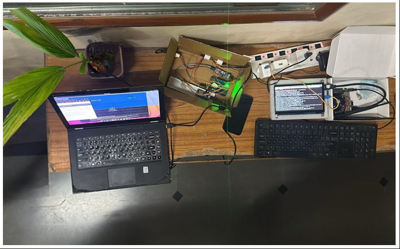

# 🌴 Sustainable Coconut Cultivation with Edge Computing and Data Analytics

This project aims to modernize traditional coconut farming in **Tumkur, Karnataka** — also known as *Kalpataru Nadu* — using Artificial Intelligence, Edge Computing, and Data Analytics. It provides farmers with real-time insights to help improve yield, detect diseases early, and receive personalized recommendations through a smart, low-cost, and scalable system.

---

## 📌 Abstract

Coconut cultivation in Tumkur faces challenges such as unpredictable yield, disease outbreaks, water stress, and lack of data-driven farming practices. This project proposes a smart system that uses AI models, deployed on edge devices like Jetson Nano, to detect coconut maturity and diseases from images, forecast yield using analytics, and generate local-language recommendations using LLMs. A web dashboard allows farmers and stakeholders to view actionable insights in real-time.

---

## 🎯 Key Features

- **Coconut Maturity Classification**: Identifies and counts coconuts at different stages (immature, tender, mature).
- **Disease Detection**: Identifies common diseases affecting coconut leaves (e.g., leaf blight, yellowing).
- **Edge Computing**: Real-time processing on Jetson Nano using onboard AI models.
- **LLM-Powered Recommendations**: Provides personalized suggestions in English or Kannada based on detected conditions.
- **React Dashboard**: A modern frontend interface to visualize the processed insights from the farm.

---

## 🧱 System Architecture

A drone or camera captures images of the coconut trees. These are processed on the edge device (Jetson Nano), which runs trained AI models (YOLOv11 for maturity, MobileNetV2 for disease). Results are sent to a backend (Flask) and displayed on a React dashboard. A large language model interprets the results and provides localized farming advice.

---

## 🌿 Technologies Used

| Layer              | Technologies                         |
|--------------------|--------------------------------------|
| Object Detection   | YOLOv11                              |
| Disease Detection  | MobileNetV2                          |
| Edge Hardware      | NVIDIA Jetson Nano                   |
| Backend            | Flask / FastAPI                      |
| Frontend           | React.js                             |
| Database           | PostgreSQL / InfluxDB                |
| LLM Integration    | OpenAI GPT / Google Gemini API       |
| Tools              | LabelImg, Git, Postman, Netlify, etc.|

---

## 📊 Results

| Parameter                     | Performance            |
|------------------------------|------------------------|
| Coconut Detection Accuracy   | 93%                    |
| Disease Detection Accuracy   | 87%                    |
| Jetson Nano Inference Time   | Under 2 seconds        |
| Dashboard Update Speed       | Real-time (1s latency) |
| LLM Response Time            | 2–3 seconds            |

---

## 📂 Dataset Overview

- ✅ 1000+ labeled coconut images captured from Tumkur farms.
- ✅ Manually annotated using LabelImg.
- ✅ Labels for maturity: Immature, Tender, Mature.
- ✅ Labels for disease: Leaf blight, Yellowing, Healthy, Wilt.

---

## 🗺️ Regional Impact – Tumkur (Kalpataru Nadu)

- 🥥 Major contributor to Karnataka’s coconut yield.
- 🚱 Faces drought and climate stress.
- 📉 Approx. 28% yield gap due to poor diagnosis and timing.
- 🌱 This project directly assists farmers with timely, AI-based decisions in a localized format.

---

